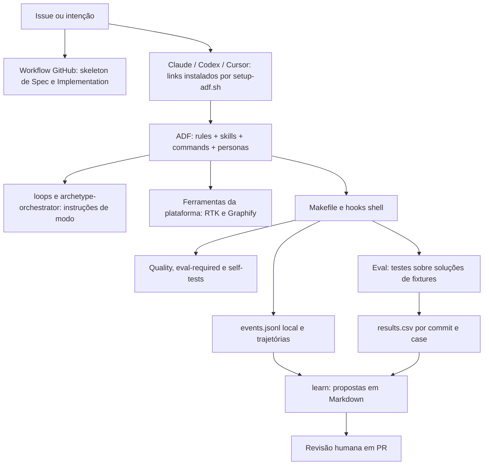
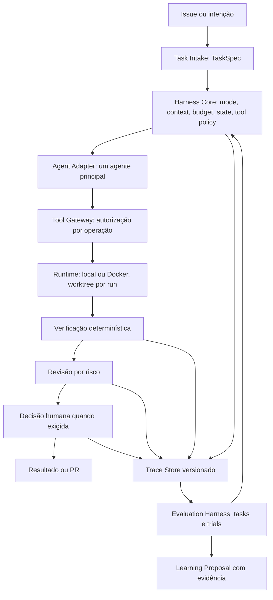

# Spec: evolução incremental para Agent Development Harness

- Status: proposta para revisão humana; não autoriza implementação nem altera políticas vigentes.
- Data: 2026-09-17.
- Baseline inspecionada: `f13e147`, branch `feat/evaluation-driven-development`.
- Modo desta entrega: Prototyper — discovery e arquitetura, sem código de execução.
- Intenção de origem: solicitação «Evolução do Agent Flow para Agent Development Harness».
- Decisão: [ADR 0005 proposto](../../ai-development-framework/docs/architecture-decision-records/0005-agent-development-harness.md).

## 1. Resultado e limite desta entrega

Evoluir o core compartilhado para executar tarefas com políticas verificáveis e comparar
configurações por sucesso, custo, tempo, risco, retrabalho e intervenção humana. Preservar
Claude, Codex e Cursor como superfícies de integração, sem presumir paridade de runtime.

Esta Spec contém o mapa atual, gaps, contratos propostos, decisões, backlog e critérios de
aceite. As fases H0–H7 abaixo pertencem a este plano; não renumeram as fases do roadmap antigo.
Não são entregues nesta PR: novos executores, schemas executáveis, políticas ativas, servidores
MCP, mudanças de skills, migração de arquivos, benchmark de modelos ou implementação das fases.
As issues descritas são unidades prontas para criação, não tickets já abertos.

## 2. Método e evidências

Foi lido o `AGENTS.md` integralmente, incluindo a instrução RTK, as regras do core e de docs,
o roteador de archetypes e as skills de discovery/planejamento/revisão. Graphify foi consultado
para localizar core, adapters, archetypes, observability, eval, gates, learning e runtime;
os resultados foram conferidos nos scripts. Grafo local é índice auxiliar, não comprovação
de comportamento. Ausente significa «não localizado na baseline», não impossível na plataforma.

Nos caminhos desta Spec, **ADF** significa `ai-development-framework/`. As referências E1–E12
abaixo são arquivos reais; os caminhos da arquitetura-alvo são propostas explicitamente marcadas.

| ID | Evidência | O que comprova |
| --- | --- | --- |
| E1 | [setup-adf.sh](../../setup-adf.sh), [Makefile](../../Makefile), [gitignore](../../.gitignore) | Core único, links por plataforma, comandos locais, artefatos gerados ignorados |
| E2 | [AGENTS.md](../../AGENTS.md), [CLAUDE.md](../../ai-development-framework/CLAUDE.md), [loops](../../loops/README.md), [router](../../ai-development-framework/skills/archetype-orchestrator/SKILL.md) | Cinco modos documentais, hand-offs e orçamento prescritivo |
| E3 | [commands/review.md](../../ai-development-framework/commands/review.md), [skills/pr-review](../../ai-development-framework/skills/pr-review/SKILL.md), [agents](../../ai-development-framework/agents/staff-architect.md) | Painel de reviewers em paralelo e decisão arquitetural humana |
| E4 | [ci-quality-gates.sh](../../ai-development-framework/hooks/ci-quality-gates.sh), [thresholds](../../ai-development-framework/rules/quality-thresholds.md), [eval-required](../../ai-development-framework/hooks/eval-required.sh) | Gates por stacks detectadas, contratos como self-tests, cobertura de mudanças de comportamento |
| E5 | [MCP audit](../../ai-development-framework/hooks/mcp-audit.sh), [inventory](../../ai-development-framework/mcp/servers.json) | Auditoria estática, allowlists e inventário atualmente vazio |
| E6 | [observability.sh](../../ai-development-framework/hooks/observability.sh), [observability docs](../../ai-development-framework/docs/observability/README.md) | JSONL local, trajetória por task, contadores e métricas fornecidas pelo runtime |
| E7 | [eval-agent-flow.sh](../../ai-development-framework/hooks/eval-agent-flow.sh), [eval docs](../../ai-development-framework/docs/evals/README.md), [results.csv](../../ai-development-framework/docs/evals/results.csv) | Reexecução de testes de fixtures, deduplicação por commit+case, duas tasks |
| E8 | [learn.sh](../../ai-development-framework/hooks/learn.sh), [eval-diagnose](../../ai-development-framework/hooks/eval-diagnose.sh), [learn-apply](../../ai-development-framework/hooks/learn-apply.sh) | Propostas sem aplicação automática, evidências e proteção contra sobrescrita |
| E9 | [graph-check](../../ai-development-framework/hooks/graph-check.sh), [graph-update](../../ai-development-framework/hooks/graph-update.sh), [pre-commit](../../ai-development-framework/hooks/pre-commit), [Graphify skill](../../ai-development-framework/skills/graphify/SKILL.md) | Consulta, marcador stale, refresh best-effort e checagem de ancestralidade |
| E10 | [workflow canônico](../../ai-development-framework/.github/workflows/quality-gates.yml), [pipeline docs](../../ai-development-framework/docs/github-native-pipeline.md) | Issue → Spec → aprovação → Implementation, proteção por associação e regras externas |
| E11 | [maintenance-routine](../../ai-development-framework/hooks/maintenance-routine.sh), [metrics history](../../ai-development-framework/docs/metrics/history.csv) | Rotinas Maintainer e snapshots; medição incompleta |
| E12 | [roadmap](../../ai-development-framework/docs/roadmap.md), [install](../../ai-development-framework/docs/install.md), [settings](../../ai-development-framework/settings.json), [core README](../../ai-development-framework/README.md) | Intenções históricas e divergências de documentação/ativação |

## 3. Arquitetura atual e matriz de capacidade



| Capacidade solicitada | Estado | Implementação atual / lacuna | Dívida ou próximo passo |
| --- | --- | --- | --- |
| Core independente de provider | Parcial | ADF reúne regras e hooks compartilhados (E1); execução continua no host | Acrescentar coordenação executável sem mover o core |
| Adapters Claude/Codex/Cursor | Parcial | `setup_claude`, `setup_codex`, `setup_cursor` instalam links; não implementam `execute/cancel/capabilities` | Separar adapter de instruções de adapter de execução; conservar os primeiros |
| Archetypes como modos | Existente | Cinco modos e aliases `make loop-*`; alvo só imprime contexto (E2) | Políticas tipadas e enforcement ainda ausentes |
| Skills, commands e hooks | Existente | ADF contém skills Markdown, comandos e hooks Bash; auditoria e self-tests | Preservar nomes e pontos de entrada; exigir eval para mudanças |
| Task Intake / TaskSpec | Parcial | Issue, PRD e skeleton Spec (E10) | Normalização, revisão imutável e aceites executáveis ausentes |
| Mode Router executável | Ausente | Skill classifica por instruções (E2) | Configuração versionada e decisão registrada |
| Context Manager | Parcial | Graphify, leitura de arquivos, skills e ADRs selecionados pelo agente | Sem API, ranking reproduzível, freshness por item ou orçamento aplicado |
| Working / semantic / procedural / episodic / domain context | Parcial | Arquivos/diff; grafo; skills/regras; traces; docs/ADRs dispersos | Não há catálogo único nem política de retenção/seleção |
| Budget Manager | Parcial | Campo `budget_remaining`, regras de teto, RTK e `make token-budget` | Comando reporta métricas, não cancela execução nem aloca sub-budget |
| State Manager | Parcial | Git, labels, trajectories e outcomes | Sem run ID, máquina de estados persistida ou retomada segura |
| Sete contratos versionados | Ausente | JSONL e CSV são formatos implícitos; «contracts» em quality são self-tests (E4) | Formalizar schemas sem renomear self-tests existentes |
| Tool Registry / Tool Gateway | Parcial / ausente | `mcp/servers.json` e auditoria estática existem, catálogo vazio (E5); sem interceptação geral | Registry por operação e autorização efetiva antes do efeito |
| Runtime local / Docker / worktree | Ausente | Hooks executam no checkout/processo corrente; CI usa runner GitHub | Não há protocolo nem isolamento, timeout/limites comuns ou limpeza por run |
| Deterministic verification | Parcial | npm tests, checks opcionais, complexidade shell, evals e contratos (E4) | Sem pipeline geral build→test→lint→types ou resultado por gate |
| Architecture / security checks | Parcial | Regras, madge opcional, auditor MCP e guard de diff CI | Cobertura limitada; não equivalem a análise completa de segurança/arquitetura |
| Functional graders | Parcial | Testes Node e unittest das fixtures (E7) | Só funcionalidade das soluções, sem artefato protegido por trial |
| LLM review por risco | Parcial | Personas e painel prescritivo (E3) | Classificador, seleção e custo de revisão ausentes |
| Human gates | Parcial | Aprovação de plano e associação GitHub; gosto/irreversíveis em instruções | Sem autorização vinculada ao hash da operação para todos os efeitos solicitados |
| Trace Store / observabilidade | Parcial | JSONL local, trajetórias e resumo shell (E6) | Sem IDs de run/event, schema version, dimensões experimentais e isolamento de writers |
| Evaluation Harness | Parcial | Runner determinístico de fixtures e diagnóstico (E7) | Não invoca modelos/adapters; não cria trials independentes |
| Dataset reproduzível | Parcial | `sum-bug` JS e `median-bug` Python, soluções já corrigidas, testes e trajetórias | Separar seed defeituoso, solução referência e grader; ampliar representatividade |
| Resultados comparativos | Ausente | CSV tem oito linhas históricas de gates aprovados antes desta sessão | Sem evidência de superioridade de modelo, policy, provider ou multi-agent |
| Learning loop controlado | Existente | Propostas mecânicas, confiança low/medium, PR só de propostas (E8) | IDs precisos de evidência e avaliação antes/depois ainda parciais |
| Governança neutra entre hosts | Parcial | Core e checks locais reutilizáveis; permissões dependem do host | Não declarar controles que adapters não conseguem impor |

### Métricas: o que os dados permitem concluir

Na baseline E7 contém duas tasks × quatro commits, todas `resolved=yes`. O runner usa a data
do commit, não a data do trial, e substitui a linha do mesmo commit+case. `iterations=2` e
`est_tokens=900/850` vêm das trajetórias estáticas; o runner não confirma a identidade do
modelo nelas declarada nem mede tokens atuais. Isso é evidência de regressão das fixtures,
não taxa de sucesso de oito novas execuções de agentes.

E11 contém dois snapshots com coverage/mutation/complexity/cycles `na`; economia RTK é
informação da ferramenta local, não custo atribuível a este experimento. E6 conta outcomes
de eventos, não tasks únicas; quality e eval podem acrescentar eventos para a mesma task.
Não há medidas de first-pass success, minutos de review humano, tool calls, retrabalho ou
defeitos pós-aceite. Nenhuma escolha de modelo/provider será justificada por esses números.

## 4. Divergências e decisões propostas

| Divergência validada | Impacto | Recomendação / momento de aprovação |
| --- | --- | --- |
| Diretórios `core/`, `adapters/`, `runtime/` etc. não existem como na visão conceitual; ADF já é core (E1) | Uma mudança literal duplicaria/moveria conceitos e quebraria distribuição | Evoluir dentro de ADF, manter superfícies atuais; ADR 0005 proposto |
| E2 já chama archetypes de modos, mas E3 pede reviewers paralelos por padrão | Não basta «renomear agentes»; há conflito de política | Manter cinco modos e propor revisão por risco em H6; só alterar instruções após aprovação |
| E4 chama self-tests de contracts; o pedido usa contracts para schemas | Termos homônimos podem levar à remoção indevida de testes | Manter self-tests e adicionar schemas versionados com nome explícito |
| E7 valida soluções existentes, embora roadmap E12 proponha execução de prompts | Tratar pass das fixtures como benchmark induz escolha errada de modelo | Manter regression runner e criar trials separados em H4 |
| E4 pode contar o comando de eval como gate verde mesmo quando um runtime de fixture faltou e o comando retorna 0 | Agregado verde não prova execução de todos os subgates | `GateResult` deve preservar skipped; H1 prova estado e H4 integra o conjunto |
| `make quality` não implementa build/lint/typecheck gerais e detecta só root JS ou sandbox JS e manifests Python na raiz | «Todas as stacks» não significa todos os pacotes de monorepo | Inventário explícito de gates com aplicabilidade; integrar ordem em H6 sem retirar checks existentes |
| `sandbox/package.json` define test/lint/build como `echo ... ok` | O gate npm aprovado é um placeholder, não teste funcional; os testes reais desta baseline estão nas fixtures e self-tests | Não usar esse gate como evidência funcional; substituir por check real em issue de verificação |
| «Ponytail review gate» no workflow apenas executa `git diff --check` (E10) | Nome pode sugerir review semântico automatizado inexistente | Documentar como whitespace check; ajustar nome em PR futura do template canônico |
| `graph-check` aceita stamp ancestral e ignora falha de refresh (E9) | Ancestralidade sozinha não prova freshness semântica/conteúdo | Registrar refresh e hash dos inputs no context provider H5; não usar esse gate como prova de isolamento/segurança |
| `settings.json` usa `bash hooks/...`, mas setup não instala settings e hooks estão sob ADF (E1/E12) | «hooks active» no guia não é garantido por setup, fora o pre-commit | Testar wiring por adapter e cwd; corrigir docs em issue própria, sem mudar permissões nesta PR |
| README do core recomenda `.cursorrules`; script instala `.cursor/commands` (E12/E1) | Guia não descreve o wiring real | Guiar por `setup_cursor`, testar plataformas instaladas; não presumir capabilities atuais do produto |
| `docs/roadmap.md` descreve gates comentados, primeiro slice e grafos de commits antigos | Diagnóstico histórico já foi parcialmente superado | Preservar histórico datado; esta Spec passa a ser o plano H0–H7 após aprovação |
| `docs/install.md` sugere `git clean -fdx` e afirma nada do usuário ser perdido | O comando pode remover arquivos reais não rastreados | Substituir futuramente por remoção de links comprovadamente gerados; não executar esse rollback |
| Labels `/approve-plan` verificam associação, não identidade humana nem aprovação vinculada ao conteúdo (E10) | Agente associado também pode emitir o comando; alteração posterior pode invalidar consentimento | Exigir review humano do SHA e rulesets; estado externo do GitHub deve ser verificado na entrega, não presumido |

Todas as mudanças de arquitetura/controle acima são propostas. Esta PR não as aplica e não
se autoaprova. Em particular, não emitir `/approve-plan`, não fazer merge e não iniciar H1
até revisão humana da Spec e do ADR. Correções documentais futuras não significam concessão
automática de permissões.

## 5. Arquitetura-alvo e fronteiras



O Human Gate também ocorre **antes de qualquer operação sensível** no Gateway; sua posição
final no diagrama não autoriza executar primeiro e pedir aprovação depois. Verificação final
avalia o resultado; política e autorização protegem cada efeito durante toda a execução.

O Agent Harness executa **uma** task/run e devolve artefatos e eventos. O Evaluation Harness
seleciona tasks/configurações, cria runs isolados, aplica graders protegidos e agrega resultados.
O core não importa SDKs de providers, Docker, Graphify ou Serena; detalhes implementam contratos.
Contratos são arquivos de dados e funções pequenas, sem framework agentic, broker ou serviço novo.

| Responsabilidade | Local proposto, criado somente quando necessário | Reuso |
| --- | --- | --- |
| Schemas | `ADF/contracts/v1/` | Novo contrato de dados, self-tests continuam em hooks |
| Core | `ADF/harness/` | Orquestra hooks/Makefile, não reimplementa seus gates |
| Modes | `ADF/harness/modes/` | Políticas referentes a `loops/*.md`; loops continuam documentação |
| Execution adapters | `ADF/adapters/{claude,codex,cursor}/` | Links de `setup-adf.sh` permanecem adapters de instruções |
| Registry / Gateway | `ADF/tools/` | Importar descritores MCP existentes, sem segundo inventário manual de servidores |
| Runtime | `ADF/runtime/` | Git worktree + processo local; Docker como segunda implementação |
| Context providers | `ADF/harness/context/` | Arquivos/rg, Graphify existente, Serena opcional |
| Verification | `ADF/verification/` | Invoca hooks existentes, acrescenta resultados e classificação |
| Experimentos | `ADF/evals/` | Runner/matrizes/graders novos; fixtures atuais continuam em `ADF/docs/evals/` |
| Evidência | `ADF/docs/observability/`, `ADF/docs/evals/`, `ADF/docs/traces/` | Não mover históricos nem misturar trials com linhas legadas |
| Specs e decisões | `docs/specs/` e `ADF/docs/architecture-decision-records/` | Convenções do pipeline e ADRs existentes |

Não criar diretórios vazios para preencher este desenho. A forma física pode ser menos granular
que a conceitual: um módulo curto pode cobrir estado e orçamento até existir motivo para separação.

### Modos e orçamento

Proposta de políticas com versão, hash e precedência: restrições organizacionais/repositório e
capabilities do runtime limitam a RunConfig; o modo pode restringir, nunca ampliar permissões.
Falha de detecção ou conflito de política bloqueia a operação. Routing ambíguo pede esclarecimento
ou usa Prototyper em escopo reversível; não presume autorização de produção.

| Modo | Contexto e ferramentas | Orçamento | Verificação / risco / autonomia |
| --- | --- | --- | --- |
| Prototyper | Task, arquivos relevantes; ferramentas de sandbox | Teto curto explícito por run | Experimentação reversível; gate funcional mínimo; gates do repo na entrega |
| Builder | Spec aprovada, diff, dependências diretas; edição e testes | Teto para implementação + verificação reservado | Gates obrigatórios; revisão conforme risco; sem deploy implícito |
| Grower | Baseline, dataset, traces e configuração | Teto por trial e experimento | Eval antes da mudança; comparação pareada; parar após duas iterações sem ganho observado |
| Sweeper | Diff, grafo, usos e métricas; RTK | Teto explícito; medir benefício | Comportamento preservado e mesmos testes; ampliação de escopo exige nova decisão |
| Maintainer | Fronteiras de confiança, dependências e auditorias | Teto por auditoria | Checks estritos; risco alto requer especialista independente e aprovação humana |

Cada RunConfig fixa limites de tokens, tempo, tool calls e, quando calculável, custo, mais uma
reserva de verificação. Nenhum número padrão de custo é inventado. Se tokens não são observáveis,
o limite não pode ser declarado enforceable: registrar unknown e impor tempo/tool calls; recusar
runs que exijam teto token/custo rígido sem medição disponível. Subagentes consomem o mesmo teto
global e têm sub-budget; só criar quando tarefa independente, especialidade, risco, contexto ou
evidência de eval justificarem. Registrar motivo e efeito medido; um modo não cria outro agente.

### Runtime e ferramentas

Protocolo mínimo: `prepare(run_config) -> handle`, `execute(handle, operation) -> result`,
`cancel(handle)`, `collect(handle)`, `cleanup(handle)`, `capabilities()`. IDs e referências
serializáveis, sem classes-base ou factories antecipadas. Cancelamento é idempotente.

Worktree destacado na revisão exata por run, registro de ownership e exportação do diff antes
da limpeza. Preservar arquivos/branches do usuário. Local é adequado a código confiável:
worktree isola mudanças de arquivos, **não** é sandbox de segurança. Recusar rede/segredos/recursos
que o provider não consegue limitar. Docker: imagem fixada por digest, usuário sem root,
sem socket Docker ou mounts do host extras, rede negada por padrão, CPU/memória/PIDs/tempo
limitados, workspace como único mount de escrita. Não disponibilizar secrets por herança do
ambiente; somente referências aprovadas, redaction antes da gravação e expiração ao terminar.

Gateway resolve capability e argumentos tipados; autoriza leitura/escrita, paths, rede e efeito
antes de executar; limita output e timeout e registra proveniência. Não classificar shell
arbitrário como read-only por prefixo: registrar a operação real ou negar. Capabilities do host
não interceptáveis devem constar como limitação, e esse adapter não entra em trials que exijam
controle completo. Aprovação de uma ferramenta não aprova todos os seus argumentos/efeitos.

## 6. Contratos propostos

Formato: JSON e JSONL UTF-8, schemas JSON Schema versionados, identificadores opacos e paths
relativos ao workspace. Schema e exemplos são parte de H1, não são código gerado nesta Spec.
Cada documento inclui `schema_version: "1.0"`; semver de schema é separado de `VERSION` do core.
Major desconhecido falha; adição opcional compatível incrementa minor. Campos desconhecidos
que afetem política são rejeitados; extensões informativas ficam em `extensions`. Na primeira
versão leitores aceitam apenas versões explícitas suportadas. Mudança obrigatória/semântica é
major, com fixtures antigas e guia de migração. `null` significa desconhecido; zero é medido.

Campos abaixo são obrigatórios salvo `?`; nulabilidade está indicada. Hashes são SHA-256,
timestamps UTC RFC3339, contagens inteiras não negativas, durações em segundos e custos em USD.
Nenhum contrato carrega conteúdo de segredo ou raciocínio privado: traces guardam decisões
resumidas, ações, observações verificáveis e referências a artefatos sanitizados.

| Contrato | Campos e semântica |
| --- | --- |
| TaskSpec | `task_id`, `revision`, `source {kind,ref}`, `objective`, `repo_revision`, `scope {allowed_paths,forbidden_paths}`, `acceptance[] {id,description,grader_ref}`, `constraints[]`, `risk {level,reasons[]}`, `approval_refs[]`; contexto da task é dado não confiável, não permissão |
| RunConfig | `run_id`, `task_ref {id,revision,sha256}`, `model {provider,id,version:null|string,parameters}`, `adapter {id,version,capabilities_hash}`, `mode {id,version}`, `context_policy {id,version}`, `toolset {id,sha256}`, `runtime {provider,version,image_digest:null|string,network,secret_refs[],limits}`, `budget {tokens:null|int,seconds,tool_calls,cost_usd:null|number}`, `verification_policy {id,version}`, `policy_hash`, `seed:null|int`, `experiment_id:null|string`, `trial_id:null|string` |
| ContextItem | `item_id`, `kind` = working/semantic/procedural/episodic/domain, `source {uri,revision,sha256}`, `relevance` 0..1, `freshness {checked_at,status,source_revision}`, `estimated_tokens`, `estimator_version`, `provenance {provider,version,trust}`, `selection_reason`, `content_ref`; freshness = fresh/stale/unknown; conteúdo não ganha autoridade por ser recuperado |
| ToolCapability | `name`, `provider`, `version`, `description`, `operations[] {id,input_schema,read,write,network,secret_access,destructive,allowed_paths,allowed_hosts,timeout_seconds,max_output_bytes,approval,provenance_required}`; approval = never/conditional/always; condicionais apontam regra versionada e não podem relaxar human gates obrigatórios |
| RunEvent | `event_id`, `run_id`, `task_id`, `sequence`, `timestamp`, `type`, `source {component,version}`, `payload`, `artifact_refs[]`; tipos iniciais run.started/gate.started/gate.finished/run.completed; demais tipos são introduzidos com fixtures de compatibilidade |
| GateResult | `gate_id`, `run_id`, `category`, `required`, `status` = pass/fail/error/skipped, `reason_code`, `duration_seconds:null|number`, `exit_code:null|int`, `evidence_refs[]`, `checker_version`, `input_digest`; category = build/test/lint/types/architecture/security/functional/llm_review/human; só pass satisfaz required |
| EvalResult | `experiment_id`, `trial_id`, `run_id`, `task_ref`, `config_hash`, `dataset_version`, `grader_version`, `status` = success/failure/error/skipped, `task_success:null|bool`, `first_pass_success:null|bool`, `human_review_minutes:null|number`, `rework {iterations:null|int,minutes:null|number}`, `tool_calls:null|int`, `tokens {input:null|int,output:null|int}`, `duration_seconds:null|number`, `estimated_cost {usd:null|number,pricing_ref:null|string}`, `gates[]` de GateResult, `post_acceptance_defects {count:null|int,window_end:null|string,issue_refs[]}`, `artifact_refs[]` |

Eventos futuros de H2–H6: context.selected, mode.changed, tool.requested/authorized/denied/completed,
budget.exhausted, runtime.cancelled, review.completed, human.requested/decided. Payload por tipo
tem schema; `human.decided` inclui ator humano verificado, decisão, expiração, hash do objeto e
evidência da revisão. A plataforma, não o agente, atesta essa decisão. Retomada exige nova
autorização quando revision/policy/argumentos mudarem; não repetir writes automaticamente.

### Estado, persistência e compatibilidade

Estados propostos: pending → running → verifying → awaiting_review/awaiting_human → completed;
failed/cancelled podem terminar qualquer estado ativo. Sucesso requer todos os gates obrigatórios
pass e aprovações válidas. Retry é novo run/trial e aponta o anterior, nunca sobrescreve evidência.

Um writer por run, JSONL separado por run e sequência monotônica; agregação é posterior.
Duplicatas por `event_id` não contam duas vezes. Queda/início sem término deixa run incompleto,
não sucesso; uma linha incompleta é reportada e preservada para diagnóstico. Não há retomada
automática de efeitos na H1. Escrita de trace indisponível impede sucesso do caminho instrumentado.

Preservar `observability.sh record|complete|summary`, variáveis e JSONL legado, campos e CSV
atuais. Eventos legados não ganham run/model/trial inventados. H1 escreve opt-in em
`ADF/docs/observability/runs/<run_id>/events.jsonl`; projeção legada mantém o writer atual.
Readers legados continuam lendo somente o arquivo antigo, sem duplicação na contagem.
Para o caminho opt-in, gravar evento v1 antes da projeção; se qualquer escrita falhar, não emitir
sucesso. Sem transação entre arquivos: registrar erro e reconciliar manualmente, sem replay
automático que duplique o legado. Logs de runs continuam locais/ignorados; a PR leva fixtures
sanitizadas e evidência resumida, não histórico privado.

## 7. Verification e Human Gates

Ordem alvo: build/compilação → testes → lint → types → invariantes arquiteturais → segurança →
critérios funcionais → reviewer LLM selecionado → decisão humana, quando aplicável. Definir
aplicabilidade antes do run; registrar skipped com motivo se não houver stack/configuração.
Um gate required skipped/error/fail bloqueia aceite, mesmo com exit code agregado zero.
Checks independentes poderão ser paralelizados depois de medir benefício, mantendo dependências
e vedando review LLM como substituto de gates. Os hooks atuais continuam sendo a implementação
dos checks já disponíveis; não interpretar seus rótulos como evidência que não produziram.

Risco inicial por regras sobre diff e efeitos: baixo (docs sem políticas), médio (lógica/API
interna), alto (auth, dados sensíveis, migrações, infraestrutura, permissões, contratos públicos).
Paths são sinal, não prova: efeitos e conteúdo podem elevar risco. Desconhecido assume alto para
efeitos sensíveis. Reviewer de domínio só quando houver gatilho; discordância preserva bloqueio.

| Operação | Aprovação humana necessária antes de |
| --- | --- |
| Deploy em produção | Executar deploy sobre artefato/ambiente identificados |
| Operação destrutiva | Executar sobre recursos e escopo revisados |
| Movimentação de segredos | Ler/transportar segredo entre destinos autorizados; jamais registrar valor |
| Migração irreversível | Aplicar migração; plano de recuperação obrigatório |
| Alteração de contrato público | Publicar/aplicar contrato versionado revisado |
| Arquitetura de alto impacto | Implementar decisão proposta em ADR revisado |
| Aceite de risco de segurança | Prosseguir com exceção documentada, escopo e expiração |
| Escrita em sistema externo sensível | Efetivar operação com payload/destino aprovados |

Aprovação da Spec não é aprovação genérica desses efeitos futuros. Gates de teste não removem
human gates. Mudanças de policies, skills, gates, segurança e permissões exigem evidência e PR
humana; learning tem permissão de escrita somente no diretório de propostas.

## 8. Eval Lab: protocolo experimental

Unidade: Task × Model × Adapter × Mode × Context Policy × Toolset × Runtime × Trial. Persistir
todas as dimensões e versões/hash mesmo quando apenas uma varia. Comparar uma variável por vez
no início, tasks/revisão/graders/orçamento iguais; só ampliar para interações quando houver dados.

Cada dataset fixa seed defeituoso, baseline revision, instrução, expected behavior, limites,
grader e licença/origem. Solução referência e testes de avaliação ficam fora da escrita e do
contexto do agente; guardar hash e conferir após o run. Fixar ambiente, imagem, dependências,
versions de ferramentas, parâmetros de geração, contexto selecionado e tool output sanitizado.
Seed é registrada, mas não promete determinismo do modelo. Cache/contexto não vazam entre trials.

Piloto mínimo: tasks atuais reconstruídas com seed defeituoso separado, mais tasks de alteração
multi-arquivo, autorização negada e regressão; cada task tem controle baseline que falha e
referência que passa. Duas configurações × ao menos três trials por task, sequenciais por padrão.
É smoke experimental, não amostra suficiente para declarar vencedor. Definir tamanho de amostra
da comparação seguinte com a variância observada e efeito mínimo desejado, antes de executá-la.
Adapters sem headless controlável podem exportar runs manuais, mas esses dados ficam estratificados
e não são misturados silenciosamente com trials automatizados. Falta de provider vira skipped.

Definições das métricas:

- Task success: graders funcionais passam, gates obrigatórios passam e política não é violada.
- First-pass success: primeiro artefato candidato passa sem correção após feedback de verificação.
- Human review minutes: tempo ativo informado pela revisão, separado de espera por aprovação.
- Rework: iterações e minutos de correção após primeiro candidato; não usar linhas de código.
- Tool calls: solicitações, com contagem de negadas separada; retries também são registrados.
- Tokens: consumo exposto pelo provider, distinguindo estimado e medido; ausente é null.
- Tempo: wall-clock por run e por fase; incluir falhas/timeouts no custo de execução.
- Custo estimado: uso × tabela versionada de preço; registrar origem/data/moeda, não preço atual presumido.
- Gates: resultado individual, required, causa do skip/erro e evidência verificável.
- Defeitos pós-aceite: links de issues confirmadas atribuídas ao resultado; janela proposta de 14 dias.
  Até fechar a janela, count pode ser null; ausência de coleta não é zero defeitos.

Relatórios mostram N planejados/executados/skipped/error, denominadores, sucesso por task e macro
por dataset, first-pass, mediana e p95 de tempo/custo, revisão e retrabalho. Falha de código e timeout
contam contra sucesso; indisponibilidade de infraestrutura é error separado, reportando também
taxa conservadora sobre todos os trials planejados. Não descartar tentativas ruins nem selecionar
best-of-N sem exibir N e custo total. Intervalos de incerteza e resultados pareados antecedem
qualquer recomendação; smoke pequeno é rotulado inconclusivo. Configuração é elegível apenas se
não viola gates/segurança e satisfaz limiar de qualidade pré-declarado; comparar custo/tempo/review
entre elegíveis, sem score único arbitrário. Não há vencedor estabelecido nesta Spec.

## 9. Plano incremental, issues e critérios de aceite

Cada linha é uma issue implementável e uma PR pequena, com dependências explícitas. Todos os
aceites incluem `make quality`, `make eval`, `make eval-required`, diff revisado e skips nomeados.
Novos hooks/commands/skills recebem self-test/eval antes da implementação, ou waiver datado
justificado; preferir teste negativo a waiver para segurança. Mudanças de workflow acontecem
no template canônico e são instaladas com `make ci`.

| Issue / fase | Entrega e arquivos prováveis | Dependências | Critérios de aceite adicionais | Rollback |
| --- | --- | --- | --- | --- |
| H0-01 — Aprovar arquitetura e baseline | Esta Spec + ADR 0005 | Nenhuma; explicitar base `f13e147` | Revisor consegue reproduzir mapa, identificar conflitos e aprovar primeiro slice | Fechar/reverter somente docs; nenhuma execução muda |
| H0-02 — Corrigir guias divergentes | ADF README, docs/install, docs/roadmap, docs/github-native-pipeline | H0-01 | Guias refletem links reais; rollback não apaga arquivos do usuário; fases antigas rotuladas históricas | Reverter docs específicos |
| H1-01 — Contratos e um gate real correlacionado | ADF/contracts/v1/{run-event,gate-result}.schema.json; hooks/eval-agent-flow.sh; novo writer v1 e self-test; docs/observability | Aprovação H0-01; baseline EDD disponível | Vertical slice da seção 10; legado preservado; pass/fail/skip/trace-error verificáveis | Desativar opt-in, preservar logs, reverter adições |
| H1-02 — Completar sete contratos e compatibilidade | Demais cinco schemas, exemplos e test de contratos; VERSION se exigido pela política de release | H1-01 | Exemplos válidos e inválidos de cada schema; major desconhecido recusado; null≠0; readers antigos intactos | Voltar produtor à versão anterior, não converter histórico destrutivamente |
| H2-01 — Modes e RunConfig resolvida | ADF/harness/modes, resolução mínima, referência a loops | H1-02 | Cinco policies cobrem sete dimensões; modo não cria subagente; seleção/hash auditáveis; teto inválido falha | Escolher fluxo legado explicitamente em escopo confiável |
| H2-02 — Registry e autorização antes de efeitos | ADF/tools, import de mcp/servers.json, self-tests | H1-02, H2-01 | Leitura permitida, escrita/rede/segredo/destruição negados sem escopo; argumentos hostis e ferramenta desconhecida bloqueados antes de executar | Parar runs mediados; não contornar negação voltando ao shell |
| H3-01 — Runtime local e worktree | ADF/runtime, ownership/cleanup, testes com repo temporário | H2-02 | Duas runs não alteram checkout original; timeout cancela descendentes; diff coletado; cleanup idempotente e path-safe; local recusa isolamento não suportado | Cancelar/coletar; remover apenas worktrees pertencentes ao harness |
| H3-02 — Runtime Docker | Provider Docker e policies; testes de conformidade comuns | H3-01 | Mesma task/gate em ambos providers; rede, mounts, secrets, recursos e cancelamento testados negativamente; sem Docker = skipped, nunca conformidade declarada | Parar containers próprios, exportar artifacts; local apenas se satisfizer política |
| H4-01 — Trials e adapter executável inicial | ADF/evals, primeiro ADF/adapter executável com capability probe, fixtures seed/graders | H1-02, H3-02 | Host escolhido por capability verificada, sem trocar links; três trials geram IDs/artefatos distintos; graders intocáveis; crash/error/skip preservados | Manter regression runner atual; congelar resultados novos |
| H4-02 — Comparação e métricas | Manifest de experimento e agregador; relatório datado em docs/evals | H4-01 | Piloto da seção 8 com duas configs, todas as dimensões, denominadores e métricas null quando ausentes; nenhum winner de dados insuficientes | Reverter agregador, conservar dados brutos e versão antiga do relatório |
| H5-01 — Contexto nativo + Graphify | ADF/harness/context, manifesto e orçamento de seleção | H2-01, H4-02 | Cinco kinds representáveis; hash/freshness/proveniência por item; stale/unknown sinalizados; seleção determinística dentro do teto; corpus hostil não concede permissões | Fixar política anterior e provider nativo com evidência |
| H5-02 — Serena e bakeoff | Provider opcional e experimento nativo/Graphify/Serena | H5-01, auditoria de ferramenta e disponibilidade do provider | Mesmas tasks/configs exceto provider; medir custo de indexação, contexto, sucesso e total; ausência é skipped; sem dependência obrigatória para adapters atuais | Desabilitar provider, revogar capability e preservar comparação |
| H6-01 — Ordem de verificação e review por risco | ADF/verification, rules/commands/review e skills/pr-review após aprovação; template CI se necessário | H2-02, H4-02; ADR de revisão aprovado | Ordem requerida observável; gate obrigatório skipped bloqueia; risco baixo sem painel; risco alto com reviewer independente; regressão de política vira teste | Restaurar política conservadora anterior sem desligar gates |
| H6-02 — Human decisions vinculadas à operação | Verificação de decisões/expiração e integração GitHub | H6-01 | Oito classes da seção 7 bloqueiam sem aprovação; mudança de hash invalida; próprio agente não se aprova; tempo humano/espera separados | Parar operação e exigir processo humano existente, nunca bypass |
| H7-01 — Learning com evidências de runs/trials | ADF/hooks/learn.sh, eval-diagnose, proposals/TEMPLATE e testes | H4-02, H6-02 | Proposta cita IDs e hashes; recorrência explícita; não sobrescreve humano; teste prova que rules/skills/gates/AGENTS/permissões não são escritos; mudança só em PR aprovada | Voltar ao diagnóstico legado, mantendo propostas e logs |

O primeiro adapter executável será o host instalado que comprovar execução não interativa,
captura de uso, cancelamento e integração de políticas suficientes para a task. Não escolher
modelo por nome registrado em trajetória. Essa escolha fica na issue H4-01, baseada em probe;
H1 não depende de SDK, credencial, headless de provider ou dessa decisão.

## 10. Primeiro vertical slice: um gate real com eventos v1

Objetivo implementável: **uma execução de `make eval-agent-flow CASE=sum-bug` opt-in recebe
run ID e produz RunEvent/GateResult validados; chamada sem opt-in mantém o comportamento atual**.
É instrumentação de execução real do gate existente, não trial novo de agente e não prova de
task success do harness completo. Mantém o boundary execução/avaliação explícito.

Contrato de entrada proposto (ainda não implementado): `ADF_EVENTS_V1=1` habilita o caminho;
`RUN_ID` opcional deve ser ID filename-safe validado; se ausente, gerar UUID. ID já usado é
recusado, não anexado a run anterior. `CASE` é validado contra nome de fixture permitido, sem
traversal. Diretório de logs não aceita symlinks para fora do root controlado.

Fluxo: validar entrada → criar diretório exclusivo → run.started → gate.started → teste existente
→ gate.finished com GateResult → projeção legada existente → run.completed. A duração vem do
relógio monotônico; timestamp UTC marca evento. Para runtime ausente: skipped, reason_code
`runtime_unavailable`, exit_code null, e run.completed com outcome skipped. Falha de teste:
fail e exit 1; sucesso: pass e exit 0. Incompatibilidade de schema/entrada/trace: exit 2 e
diagnóstico sem conteúdo sensível. Preservar exit 0 legado para runtime ausente nessa integração
inicial, mas jamais interpretar como aprovação; H4/H6 tornam o agregado consciente de required.

Exemplo informativo de payload `gate.finished` (IDs exemplificativos, não resultados medidos):

```json
{
  "schema_version": "1.0",
  "event_id": "example-event-3",
  "run_id": "example-run",
  "task_id": "sum-bug",
  "sequence": 3,
  "timestamp": "2026-09-17T12:00:00Z",
  "type": "gate.finished",
  "source": {"component": "eval-agent-flow", "version": "1"},
  "payload": {
    "schema_version": "1.0",
    "gate_id": "sum-bug.node-test",
    "run_id": "example-run",
    "category": "functional",
    "required": true,
    "status": "skipped",
    "reason_code": "runtime_unavailable",
    "duration_seconds": null,
    "exit_code": null,
    "evidence_refs": [],
    "checker_version": "node:unavailable",
    "input_digest": "0000000000000000000000000000000000000000000000000000000000000000"
  },
  "artifact_refs": []
}
```

Todos os payloads iniciais são fechados: run.started = `{case,repo_revision,instrumentation_version}`;
gate.started = `{gate_id,category,required}`; gate.finished = GateResult; run.completed =
`{outcome,duration_seconds,tokens_in,tokens_out,cost_usd}`, outcome = success/failure/skipped/error.
Tokens/custo são null nesse slice. Cada um dos quatro tipos exige o mesmo envelope; sequência
começa em 1. Se não for possível escrever término, o run permanece incompleto, nunca success.

Implementação mínima planejada: Bash continua entrypoint; serializer/validator pequeno em Python
stdlib, já usado nas fixtures, sem novo framework. JSON Schema é contrato publicado; validação
executável desta issue cobre o subconjunto usado pelos dois schemas com casos negativos,
sem construir validador JSON Schema genérico. Se for necessário adicionar biblioteca validadora,
justificar na PR de contratos; não expandir silenciosamente as dependências da instalação.
Sem Python no caminho opt-in: erro explícito; modo legado preservado. Definir essa dependência
no guia e nos testes, não instalá-la implicitamente em scripts de execução.

Checklist da issue H1-01, na ordem:

1. Criar teste em `ADF/hooks/test-run-events.sh` com repo/ADF temporário, caso passing e caso
   failing; antes da implementação ele falha por ausência dos eventos. Reusar isolamento dos
   testes existentes (`test-eval-agent-flow.sh`, `test-observability.sh`).
2. Definir dois schemas, quatro payloads e exemplos inválidos: ID inseguro, status desconhecido,
   número negativo, campo obrigatório faltante, major desconhecido e payload indevido.
3. Integrar somente `one_case`/`run_gate`/`record_event` do runner; localizar todos os callers,
   manter `--all`, CSV e env legados. Gravar um único completion legado, sem contagem dobrada.
4. Testar pass, fail, runtime ausente, erro de escrita, ID repetido, duas runs distintas na mesma
   task e término incompleto; igualdade dos campos/semântica legacy com opt-in desligado.
5. Provar em execução real que eventos apontam ao gate e input digest; validar todos os JSONL.
   CSV legado ainda deduplica commit+case; dois run directories preservam ambas as execuções.
6. Rodar gates obrigatórios e informar skips; incluir evidência do red→green e tamanho do diff.

Fora deste slice: novos modelos, toda a matriz experimental, Docker/worktrees, tool gateway,
context providers, reorder global de gates, replay e aprovação automática. H1-02 completa os
outros contratos antes de H2; não há necessidade de sete subsistemas para instrumentar um gate.

## 11. Riscos, dependências e rollback global

| Risco | Controle / dependência verificável |
| --- | --- |
| Baseline local EDD pode não estar em main remoto | Verificar merge/base antes da PR; usar PR empilhada sobre EDD enquanto necessário, com diff documental apenas |
| Adapters não expõem o mesmo runtime/usage | Capability probe e conformidade por versão; unsupported explícito; não fingir equivalência |
| Core virar estrutura especulativa | Criar módulos só nas issues que têm callers reais; hooks e Makefile continuam entrypoints |
| Worktree confundido com sandbox | Local só para código confiável; Docker com testes negativos; negar política não enforceable |
| Grader alterado pelo agente / vazamento de referência | Graders fora da escrita/contexto, hash antes/depois e corpus separado |
| Prompt injection via contexto/tool output | Proveniência, nível de confiança, validação na fronteira; conteúdo não pode modificar autorização |
| Trace conter secrets/PII ou raciocínio privado | Redaction antes de persistir, refs em lugar de payloads, acesso local, política de retenção definida por experimento |
| Métricas ausentes parecerem economia / taxas infladas | null, denominadores, custos das falhas, distinguir event/run e observação/estimativa |
| CSV legado perde tentativas, writers concorrem | Preservar CSV como legado; novos trials append-only por ID, um writer por run |
| Aprovação desatualizada ou autoconcedida | SHA/argumentos/policy hash, expiração e ator humano verificado; review externo ao agente |
| Learning reduzir gates para passar | Diretório de propostas como único destino automático; evidência antes/depois; revisão humana de alterações estruturais |

Dependências existentes: Bash, Git, Make; Node/Python para fixtures; jq para auditoria MCP;
RTK/Graphify conforme checks. H1 opt-in usa Python explicitamente. Docker só H3-02; credenciais
de provider e transporte de eventos apenas H4; Serena só após avaliação/auditoria H5-02.
Não há necessidade de serviço de telemetria, banco, SDK agentic ou atualização de plataforma H0/H1.

Rollback global é por PR/configuração, conservando histórico: interromper novos runs, coletar
artefatos, cancelar processos, voltar à última policy/schema suportada e ao caminho legado
permitido. Não fazer downgrade de controles para executar tarefa anteriormente negada. Não apagar
traces nem converter CSV em lugar; não usar `git clean -fdx`, `reset --hard` ou cleanup genérico.
Cada mudança pública terá versão e guia; migrations irreversíveis exigem plano/human gate próprio.

## 12. ADRs e fronteira de aprovação

| Decisão | Registro | Quando precisa estar aprovada |
| --- | --- | --- |
| Evolução dentro de ADF; um agente; separação execução/eval | ADR 0005, proposto nesta entrega | Antes de H1 |
| Schemas, versioning e projeção legada | ADR complementar de contratos; detalhamento da seção 6 | Antes de H1-01 escrever formato novo |
| Gateway, runtime e níveis reais de isolamento | ADR complementar de runtime/políticas | Antes de H2-02/H3 |
| Protocolo experimental e integridade dos graders | ADR complementar de avaliação | Antes de H4 |
| Revisão por risco e aprovação humana vinculada ao efeito | ADR complementar de verificação | Antes de H6 alterar painel/instruções |

ADRs 0001–0004 existentes continuam válidos salvo pontos explicitamente supersedidos em decisão
futura. Não criar cinco ADRs vazios nesta PR: as seções desta Spec contêm as propostas concretas;
os ADRs complementares acompanham as respectivas PRs para revisão antes de ativação.

Pronta para revisão quando: mapa/gaps conferidos; dependência EDD explícita; contratos e primeiro
slice implementáveis; issues têm dependências/aceites/rollback; relatório de validação declara
skips; ADR permanece Proposed. Pronta para implementação somente após aprovação humana da
Spec/decisões relevantes. Aceite desta documentação não implica completar nem aprovar H1–H7.

## 13. Evidência desta entrega

Validação local em 2026-09-17, sobre a baseline `f13e147` mais estes documentos:

| Verificação | Resultado e limite |
| --- | --- |
| `make quality` | Exit 0; 4 gates reportados e 9 self-tests. npm sandbox é placeholder; complexidade shell, fixtures e cobertura de comportamento são os checks efetivos |
| Skips de quality | Coverage JS sem script, ciclos sem madge, mutation sem configuração Stryker; nenhum foi medido |
| `make eval` | Exit 0; sum-bug e median-bug aprovados; eval-required satisfeito; diagnóstico sem novas propostas. Reexecuções de fixtures, não trials de modelo |
| `make eval-required BASE=f13e147` | Conferência específica do escopo documental; nenhum novo comportamento para exigir eval |
| `make mcp-audit` | Exit 0, zero servidores; não comprova segurança de tools externas |
| `make skill-audit` | Exit 0, 13 warnings preexistentes de metadados/overlap |
| `make graph-check GRAPH_CHECK_NO_REFRESH=1` | Exit 0 por stamp ancestral `3446171e`; refresh deliberadamente não executado, freshness semântica não comprovada |
| Links locais e exemplo JSON | Links resolvidos e JSON parseável; schemas ainda são proposta |
| Build/lint/typecheck | Não aplicáveis à mudança documental; scripts sandbox são placeholders, não validações adicionais |
| RTK accounting | Indisponível: `rtk gain` não conseguiu abrir o banco local; tokens/custo da sessão = na |

Os checks de eval atualizam `results.csv` por commit; essas linhas geradas são mantidas fora do
diff da Spec para que esta entrega permaneça exclusivamente documental. Eventos/trajectory
locais seguem o mecanismo existente, ignorado pelo Git. O estado remoto consultado por SSH
ainda aponta main em `3446171`: a Spec depende da branch EDD `feat/evaluation-driven-development`.
Publicar com essa base enquanto EDD não for integrada; retarget para main somente após confirmar
que contém a baseline. Não incluir a implementação EDD no diff documental desta PR.
